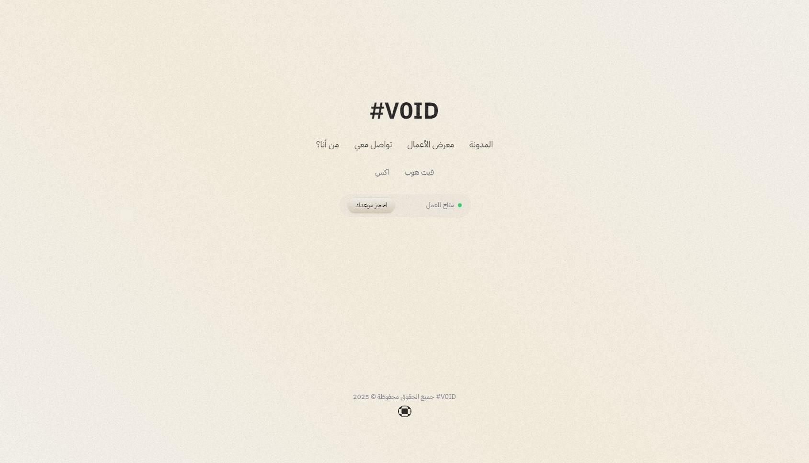

# V0ID Land
<div align="center" style="text-align: center; font-size: 1.05rem; font-style: italic;">
    My Personal Space & Website to express, write, and share my thoughts, ideas, projects and my personal journey and experiences also including my personal data. It works as a central point for me.
</div>



<div align="center" style="text-align: center;">
    <div>
        <a href="https://v0id.me/about" style="margin: 0 15px;">About</a>
        <a href="https://v0id.me/blog" style="margin: 0 15px;">Blogs</a>
        <a href="https://v0id.me/portfolio" style="margin: 0 15px;">Portfolio</a>
    </div>
</div>


## Features
- Blogging System with GPG Signing
- File Storage and Management
  - File Upload/Download
  - File Sharing
  - File Pre-signing
  - S3-compatible Storage Integration
- Portfolio Showcase
- Real-time Auto-Drafting using PostgreSQL and SSE
- Authentication System with Root GPG technique
- Modern UI with Next.js and TailwindCSS

## Tech Stack
- **Frontend**: Next.js, React, TailwindCSS
- **Backend**: Next.js API Routes
- **Database**: PostgreSQL
- ~~**Caching**: Redis~~ (Not implemented yet)
- **Storage**: S3-compatible Storage (Tigris)
- **Security**: GPG for Blog Verification
- **Runtime**: Bun

## Prerequisites
Before you begin, ensure you have the following:
- Node.js and npm (or Bun)
- PostgreSQL database
- ~~Redis server~~ (Not required yet)
- S3-compatible storage (like Tigris)
- GPG key pair for blog verification

## Environment Setup
1. Create a `.env` file in the root directory with the following variables:
```env
# Database
DATABASE_URL=postgresql://postgres:@localhost:5432/land?schema=public

# Redis
REDIS_URL=redis://localhost:6379

# GPG Keys
GPG_PUBLIC_KEY_PATH=keys/your_public_key.asc
GPG_PRIVATE_KEY_PATH=keys/your_private_key.asc

# JWT
JWT_SECRET=your_secure_jwt_secret

# S3 Configuration
AWS_ACCESS_KEY_ID=your_access_key
AWS_SECRET_ACCESS_KEY=your_secret_key
AWS_ENDPOINT_URL_S3=your_s3_endpoint
AWS_ENDPOINT_URL_IAM=your_iam_endpoint
AWS_REGION=your_region
AWS_BUCKET_NAME=your_bucket_name

STORAGE_DOMAIN=your_storage_domain
```

2. Create a `keys` directory in the root and place your GPG keys there:
```bash
mkdir keys
# Place your GPG keys in the keys directory
```

## Installation & Setup
1. Clone the repository
```bash
git clone https://github.com/v0id-user/v0id-land.git
cd v0id-land
```

2. Install dependencies
```bash
# Using npm
npm install

# Or using Bun
bun install
```

3. Set up the database
```bash
npx prisma migrate dev
```

4. Start the development server
```bash
# Using npm
npm run dev

# Or using Bun
bun run dev
```

## Docker Deployment
The project includes Docker support. To run using Docker:

```bash
docker-compose up -d
```

It yet does not include the database and redis server. You need to setup them manually.

## Status
Currently in stable state. Features are being added and refined regularly so be aware that anything might get broken along the way.

## License
This project is open-source and available under the MIT License.

---

Built with ♥ by [#V0ID](https://github.com/v0id-user)